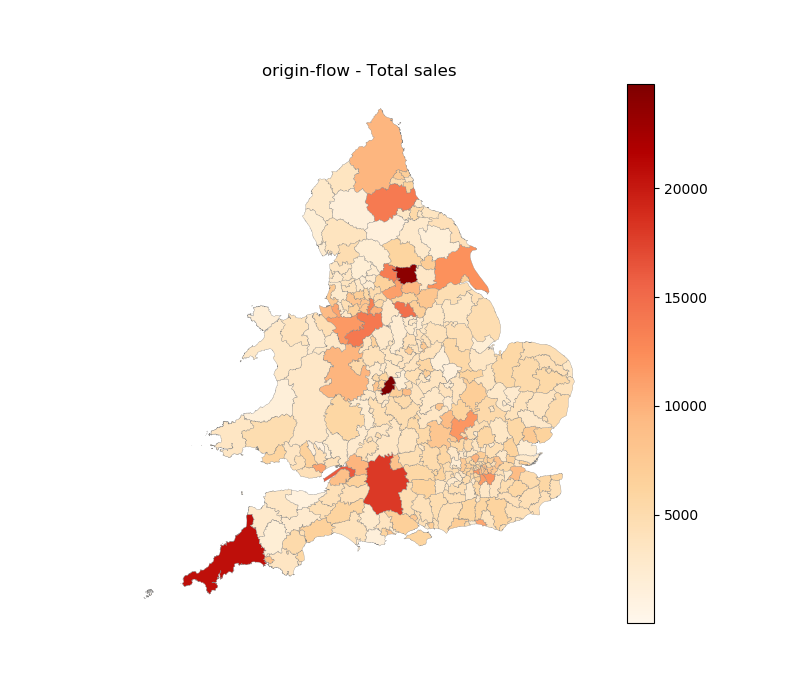
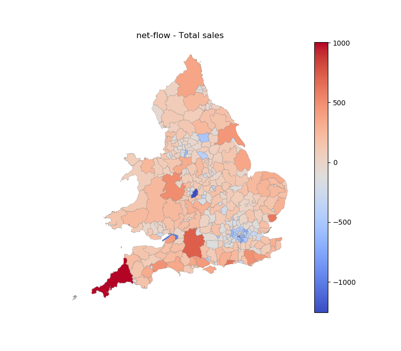
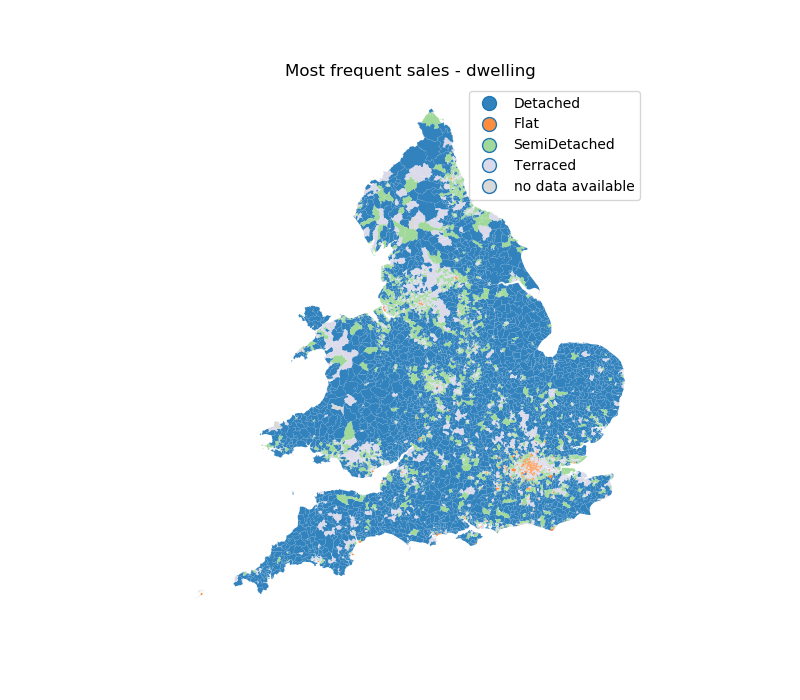
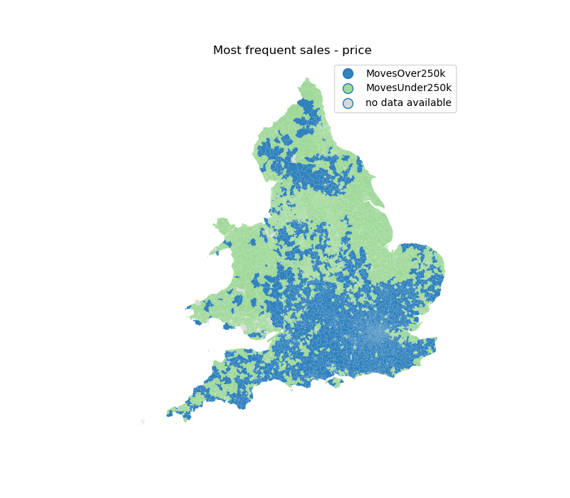
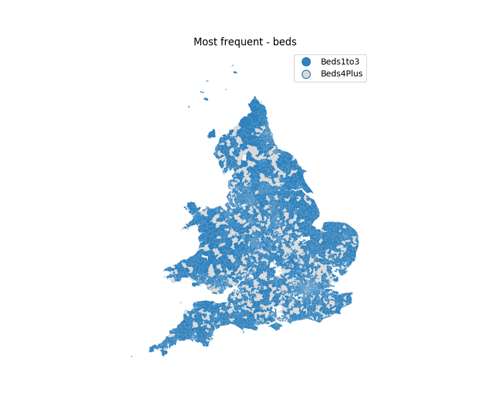
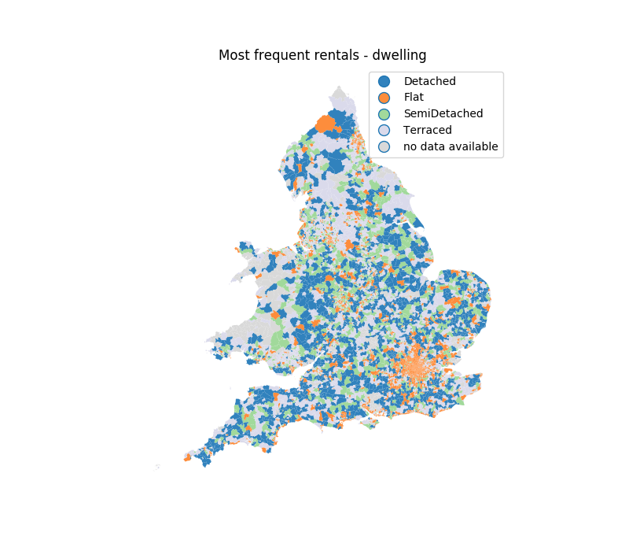
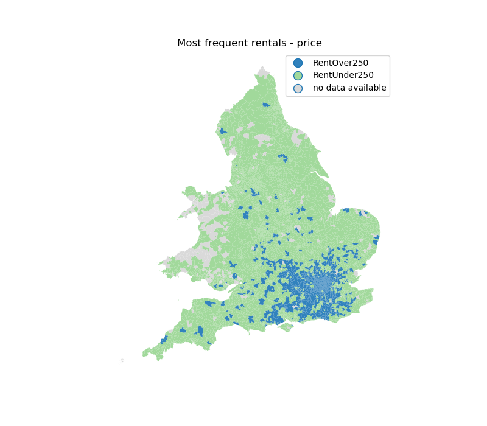
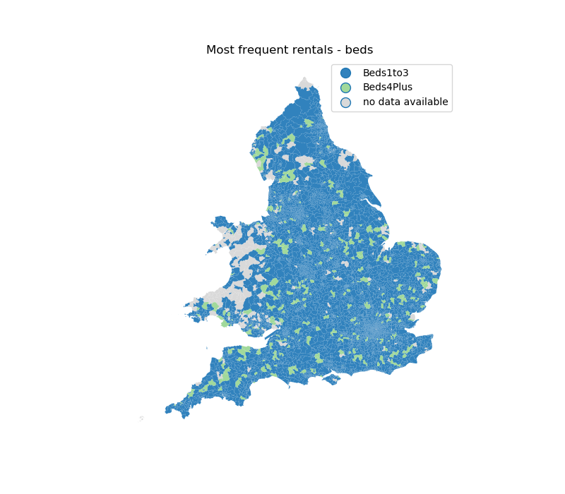
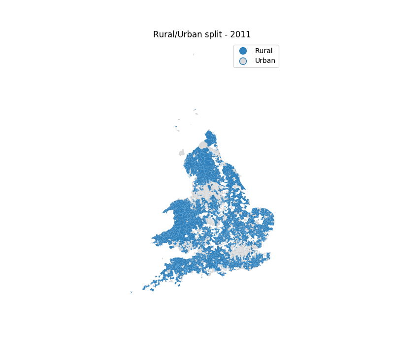
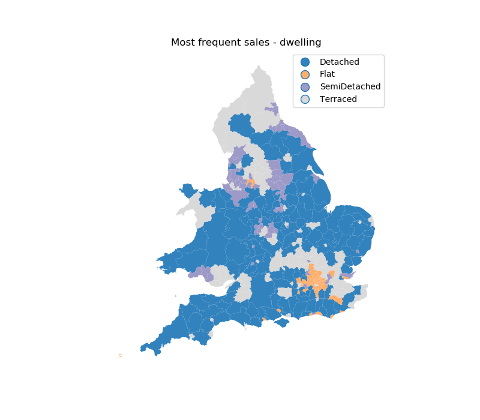

# odflows

Exploratory analysis of dwelling rentals and sales in England and Wales.

Number of sales and rentals in dataset, percentage of total in brackets:

|Property listings   |Number of Sales    |Number of Rentals | 
|--------------------|------------------:|-----------------:| 
|Total               | 1,828,646         | 1,204,913        | 
|Moves Under £250(k for sales) | 1,198,034 (65.5%) |   820,210 (68.1%)|
|Moves Over £250(k for sales)  |   630,612 (34.5%) |   376,770 (31.3%)|
|Terraced            |   533,248 (29.2%) |   275,711 (22.9%)|
|Flat                |   362,865 (19.8%) |   511,854 (42.5%)|
|SemiDetached        |   482,237 (26.4%) |   136,376 (11.3%)|
|Detached            |   450,296 (24.6%) |    85,247 (7.1%) |
|Bungalow            |         0 (0%)    |    29,977 (2.5%) |
|PropertyTypeUnknown |         0 (0%)    |   165,748 (13.8%)|
|Beds1to3            |   745,708 (40.8%) | 1,012,098 (84.0%)|
|Beds4Plus           |   198,778 (10.9%) |   154,832 (12.9%)|

Approximately 23% of records provided a forwarding postcode, therefore it is possible to obtain origin-destination pairs for 417,219 households sold (145,885 rentals). However, this will heavily bias the data, especially since forwarding is a paid service. The differences between properties listed and those with forwarding postcode can be seen below (percentage change from total in brackets):

| OD pairs          | Sales          | Rent           |
|-------------------|---------------:|---------------:|
|MovesUnder250k     | 54.8% (-10.7%) | 35.5% (-32.6%) | 
|MovesOver250k      | 45.2% (+10.7%) | 64.0% (+32.7%) | 
|Terraced           | 28.6% (-0.6%)  | 21.7% (+1.2%)  | 
|Flat               |  9.7% (-10.1%) | 32.9% (-9.6%)  | 
|SemiDetached       | 29.9% (+3.5%)  | 14.6% (+3.3%)  |
|Detached           | 31.9% (+7.3%)  | 11.6% (+4.5%)  |
|Bungalow           |    0% (+0%)    |  3.6% (+1.1%)  |
|PropertyTypeUnknown|    0% (+0%)    | 15.6% (+1.8%)  |
|Beds1to3           | 44.9% (+4.1%)  | 83.7% (-0.3%)  |
|Beds4Plus          | 19.8% (+8.9%)  | 14.7% (+1.8%)  |

To check: numbers don't match totals. Small errors expected in % due to rounding but raw numbers dont add up. Large discrepancy in bedroom information for sales. There seems to be data missing, e.g. 17% of OD pairs have a value of zero for both Beds1to3 and Beds4plus. 

As expected, reducing the data to households with a forwarding service favours more expensive moves, with around 30% increase in these rentals. The number of flats in the data also reduces significantly (10%). The changes are larger for rentals than sales, but these are relevant in both cases.

    
**Figure 1.** Number of houses listed for sale in each LAD. There is a large number of moves in the dataset across England and Wales, although more data is available in certain LADs such as Leeds, Birmingham and Cornwall. 

    
**Figure 2.** Net moves (OD-sales) in each LAD. The distribution seen is quite unexpected as big cities are losing people whilst Cornwall still has a strong net movement. London has a negative internal number of moves as expected. The differences to migration flows seen in ONS data, for example, could be due to the fact forwarding address is a paid service. The pattern observed here could indicate more affluent people or perhaphs larger families are moving out of big cities towards suburbs or the countryside, however, this behaviour should be investigated further.

We can compare data between wards to obtain general trends in the data. For example, in figure (3) we can see the most frequent type of dwelling sold in each ward. Although terraced houses are the most common property sold across the UK, these concentrate mainly in urban areas whilst most wards have a higher number of detached properties sold. It is interesting to note that Greater London has a significant number of flats being sold, being more common that terraced.

    
**Figure 3.** Most common type of dwelling sold in each ward.

Moves can be split into under or over £250,000 transactions as shown in figure (4). It is common for properties in the UK to be sold over this threshold (35% of total), however, cheaper moves are predominant in the North and East of England as well as in Wales. Price bands should be obtained to gain more insight in this subject. 

    
**Figure 4.** Most common price threshold for households sold in each ward.

It is more common for properties to be sold with one to three beds but in several wards properties with four or more are predominant. This pattern appears to be uniform across the UK. 

    
**Figure 5.** Most common number of bedrooms per household sold in each ward.

Results are very similar when observing rentals instead of sales. The main difference being the increased percentage of flats rented as well as a strong dominance of properties with one to three beds accounting for 80% of data. It is also worth noting that origin-destination pairs are even more skewed, with rents over £250 representing 64% of od pairs compared to 31% of the total rentals listed. 

    
**Figure 6.** Most common type of dwelling rented in each ward.

    
**Figure 7.** Most common price threshold for households rented in each ward.

    
**Figure 8.** Most common number of bedrooms per household rented in each ward.

Average distance between origin and destination varies for each type of sale.

Average distance between wards with type as most common:

| Average Distance (km) | Sales | Rentals |
|-----------------------|------:|--------:|
|Terraced               | 45.01 |  42.51  |  
|Flat                   | 45.27 |  42.92  |
|SemiDetached           | 51.80 |  41.62  |
|Detached               | 62.90 |  47.49  |
|Bungalow               |    na |  47.29  |
|Price Under £250 (k for sales)    | 45.31 |  42.79  |
|Price Over £250 (k for sales)     | 60.70 |  44.12  |
|Bedrooms 1-3           | 51.34 | 42.22   |
|Bedrooms 4 or more     | 56.76 | 50.19   |
|Rural                  | 56.64 | 44.30   |
|Urban                  | 49.75 | 42.21   |

The most interesting differences are that detached property sales have a much greater mobility than other types, over 10km difference. More expensive sales also have a greater mobility than cheaper ones (around 15km difference) and rural areas move more on average than urban ones.

Average distance between origin and destination:

| Average Distance (km) | Sales | Rentals |
|-----------------------|------:|--------:|
|All moves              | 54.69 |  45.14  |
|Terraced               | 41.23 |  36.58  |  
|Flat                   | 35.25 |  41.21  |
|SemiDetached           | 42.89 |  35.01  |
|Detached               | 51.90 |  39.42  |
|Bungalow               |    na |  36.51  |
|Price Under £250 (k for sales)    | 45.29 |  43.86  |
|Price Over £250 (k for sales)     | 55.19 |  42.22  |
|Bedrooms 1-3           | 46.14 |  43.69  |
|Bedrooms 4 or more     | 44.04 |  38.74  |
|Rural                  | 58.71 |  45.84  |
|Urban                  | 52.06 |  44.11  |

It is useful to look at the rural urban classification of wards stated by the ONS (see figure 9). This gives insight into some of the patterns seen in previous figures because cities behave differently to rural areas.

    
**Figure 9.** ONS rural urban classification by ward - 2011 census.

Correlation of moves with distance:     

| Correlation with Distance     | Sales  | Rentals |
|-------------------------------|-------:|--------:|
|Number of Moves                | -0.160 | -0.150  | 
|Price Under £250 (k for sales) | -0.152 | -0.112  | 
|Price Over £250 (k for sales)  | -0.091 | -0.074  | 
|Terraced                       | -0.132 | -0.083  | 
|Flat                           | -0.094 | -0.075  | 
|SemiDetached                   | -0.124 | -0.071  | 
|Detached                       | -0.089 | -0.041  | 
|Bungalow                       |     na | -0.026  | 
|Beds1to3                       | -0.145 | -0.142  | 
|Beds4Plus                      | -0.095 | -0.052  | 

Overall, there is a negative correlation between moves and distance. People are less likely to buy or rent if the destination is further away. However, these correlations are quite weak.

It is also interesting to note the different behaviours experienced by household sales originating from a rural area compared to an urban one. The former has a much larger tendency towards selling detached housing whilst the latter sells more terraced and semi-detached. As expected, the number of flats sold is significantly larger for urban areas. There is also a larger discrepancy in number of beds for urban sales comapred to rural ones.

| Sales - in   | Rural          | Urban           |
|--------------|---------------:|----------------:|
|Total         | 55,287         | 254,114         |
|Detached      | 28,421 (51.41%)|  64,293 (25.30%)|
|Terraced      | 10,964 (19.83%)|  79,722 (31.37%)|
|SemiDetached  | 14,418 (26.08%)|  79,258 (31.19%)|
|Flat          |  1,484  (2.68%)|  30,841 (12.14%)|
|MovesUnder250k| 26,547 (48.02%)| 140,216 (55.18%)|
|MovesOver250k | 28,740 (51.98%)| 113,898 (44.82%)|
|Beds1to3      | 20,279 (36.68%)| 118,359 (46.58%)|
|Beds4Plus     | 13,531 (24.47%)|  45,998 (18.10%)|

There is not much difference in sales that have rural areas as their destination compared to urban areas other than the number of flats:

| Sales - out  | Rural           | Urban            |
|--------------|----------------:|-----------------:|
|Total         |  70,178         | 234,058          |
|Terraced      |  17,376 (24.76%)|  71,278 (30.45%) |
|Flat          |   3,699  (5.27%)|  27,966 (11.95%) |
|SemiDetached  |  19,866 (28.31%)|  71,469 (30.53%) |
|Detached      |  29,237 (41.66%)|  63,345 (27.06%) |
|MovesUnder250k|  35,018 (49.90%)| 130,262 (55.65%) |
|MovesOver250k |  35,160 (50.10%)| 103,796 (44.35%) |
|Beds1to3      |  28,011 (39.91%)| 108,380 (46.30%) |
|Beds4Plus     |  16,242 (23.14%)|  42,516 (18.16%) |

The same method can be used for rentals. Note the huge increase in flats compared to sale data as well as the tendency for cheaper rent in rural areas. 

| Rentals - in        | Rural           | Urban          |
|---------------------|----------------:|---------------:|
|Total                | 12,960          | 96,251         |
|Terraced             |  2,425 (18.71%) | 21,043 (21.86%)|
|Flat                 |  1,318 (10.17%) | 36,643 (38.07%)|
|SemiDetached         |  2,242 (17.30%) | 13,342 (13.86%)|
|Detached             |  3,588 (27.69%) |  8,281  (8.60%)|
|Bungalow             |  1,150  (8.87%) |  2,545  (2.64%)|
|PropertyTypeUnknown  |  2,237 (17.26%) | 14,397 (14.96%)|
|RentUnder250         |  9,691 (74.78%) | 56,960 (59.18%)|
|RentOver250          |  3,209 (24.76%) | 38,729 (40.24%)|
|Beds1to3             |  9,718 (74.98%) | 81,799 (84.99%)|
|Beds4Plus            |  3,072 (23.70%) | 12,830 (13.33%)|

| Rentals - out     | Rural             | Urban           |
|-------------------|------------------:|----------------:|
|Total              |  17,892           | 90,373          |
|Terraced           |   3,762  (21.03%) | 19,617 (21.71%) |
|Flat               |   3,445  (19.25%) | 33,917 (37.53%) |
|SemiDetached       |   2,985  (16.68%) | 12,405 (13.73%) |
|Detached           |   3,521  (19.68%) |  8,325  (9.21%) |
|Bungalow           |   1,086   (6.07%) |  2,666  (2.95%) |
|PropertyTypeUnknown|   3,093  (17.29%) | 13,443 (14.88%) |
|RentUnder250       |  12,698  (70.97%) | 54,226 (60.00%) |
|RentOver250        |   5,103  (28.52%) | 35,638 (39.43%) |
|Beds1to3           |  14,125  (78.95%) | 76,686 (84.85%) |
|Beds4Plus          |   3,537  (19.77%) | 12,159 (13.45%) |

It is also possible to aggregate data further, into Local Authority Districts (LADs). This way some finer detail is lost but other patterns might become visible. For example, the most common type of dwelling sold in each LAD (figure 10) hints towards different behaviour in more expensive moves in the North compared to the South as well as the difference between inner and outer London.

    
**Figure 3.** Most common type of dwelling sold in each LAD.
