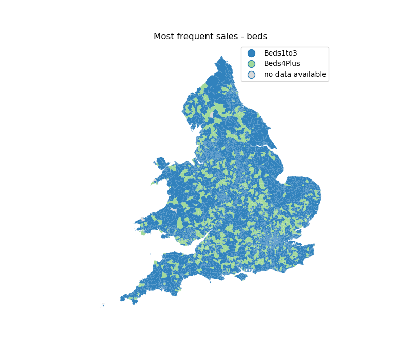

# odflows

Exploratory analysis of dwelling rentals and sales in England and Wales.

|Property listings  |Number of Sales  |Number of Rentals| 
|-------------------|:---------------:|:---------------:| 
|Total              | 1828646         |  1204913        | 
|MovesUnder250k     | 1198034 (65.5%) |   820210 (68.1%)|
|MovesOver250k      |  630612 (34.5%) |   376770 (31.3%)|
|Terraced           |  533248 (29.2%) |   275711 (22.9%)|
|Flat               |  362865 (19.8%) |   511854 (42.5%)|
|SemiDetached       |  482237 (26.4%) |   136376 (11.3%)|
|Detached           |  450296 (24.6%) |    85247 (7.1%) |
|Bungalow           |       0 (0%)    |    29977 (2.5%) |
|PropertyTypeUnknown|       0 (0%)    |   165748 (13.8%)|
|Beds1to3           |  745708 (40.8%) |  1012098 (84.0%)|
|Beds4Plus          |  198778 (10.9%) |   154832 (12.9%)|

Approximately 23% of records provided a forwarding postcodes, therefore it is possible to obtain origin-destination pairs for 417219 households sold (145885 rentals). However, this will heavily bias the data, especially since forwarding is a paid service. The differences between properties listed and those with forwarding postcode can be seen below:

| OD pairs          | Sales          | Rent           |
|-------------------|:--------------:|:--------------:|
|MovesUnder250k     | 54.8% (-10.7%) | 35.5% (-32.6%) | 
|MovesOver250k      | 45.2% (+10.7%) | 64.0% (+32.7%) | 
|Terraced           | 28.6% (-0.6%)  | 21.7% (+1.2%)  | 
|Flat               |  9.7% (-10.1%) | 32.9% (-9.6%)  | 
|SemiDetached       | 29.9% (+3.5%)  | 14.6% (+3.3%)  |
|Detached           | 31.9% (+7.3%)  | 11.6% (+4.5%)  |
|Bungalow           |    0% (+0%)    |  3.6% (+1.1%)  |
|PropertyTypeUnknown|    0% (+0%)    | 15.6% (1.8+%)  |
|Beds1to3           | 44.9% (+4.1%)  | 83.7% (-0.3%)  |
|Beds4Plus          | 19.8% (+8.9%)  | 14.7% (+1.8%)  |

To check: numbers don't match totals. Small errors expected in % due to rounding but raw numbers dont add up. Large discrepancy in bedroom information for sales.

    
**Figure 1.** Most common type of dwelling sold in each ward.

    
**Figure 2.** Most common price threshold for households sold in each ward.

    
**Figure 3.** Most common number of bedrooms per household sold in each ward.

    
**Figure 4.** Most common type of dwelling rented in each ward.

    
**Figure 5.** Most common price threshold for households rented in each ward.

    
**Figure 6.** Most common number of bedrooms per household rented in each ward.
