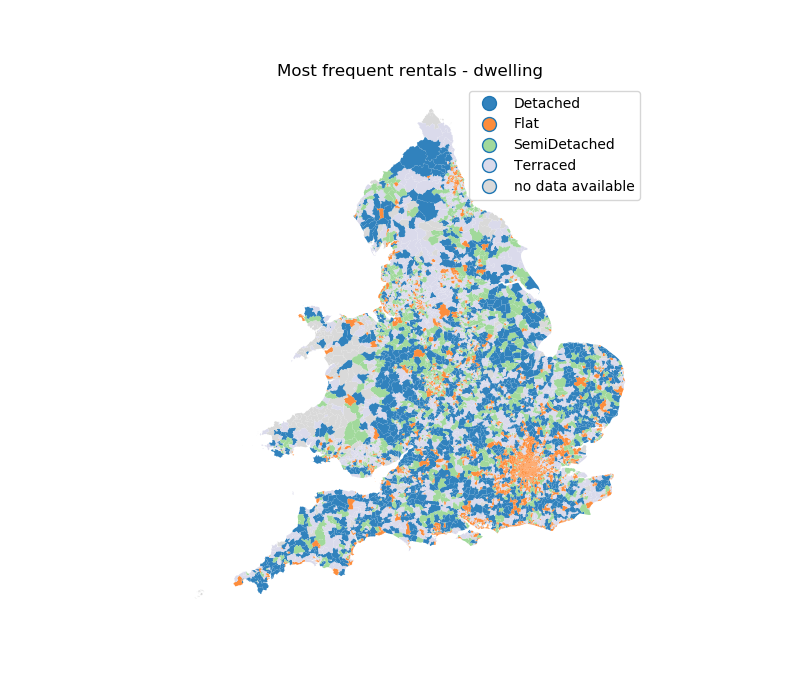
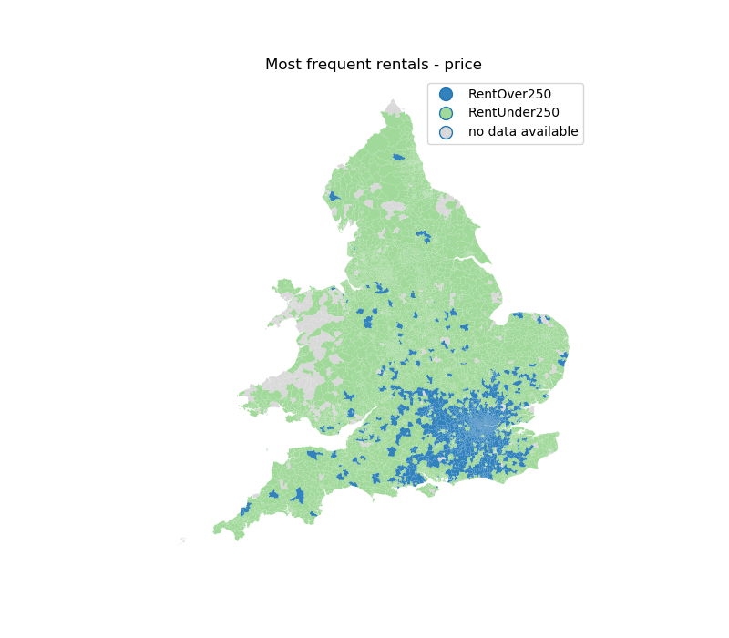
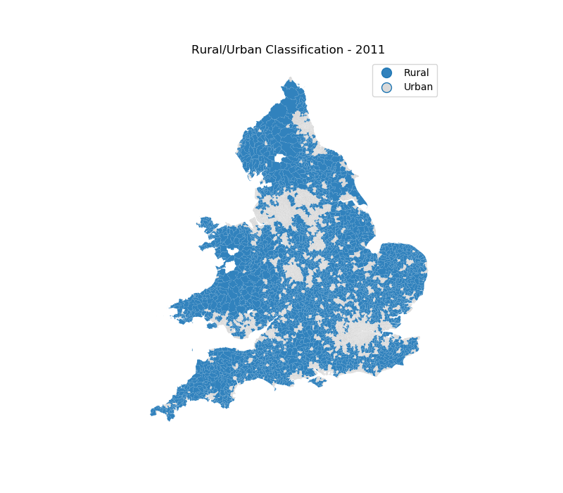

# odflows

Exploratory analysis of dwelling rentals and sales in England and Wales.

Number of sales and rentals in dataset, percentage of total in brackets:

|Property listings  |Number of Sales    |Number of Rentals | 
|-------------------|------------------:|-----------------:| 
|Total              | 1,828,646         | 1,204,913        | 
|MovesUnder250k     | 1,198,034 (65.5%) |   820,210 (68.1%)|
|MovesOver250k      |   630,612 (34.5%) |   376,770 (31.3%)|
|Terraced           |   533,248 (29.2%) |   275,711 (22.9%)|
|Flat               |   362,865 (19.8%) |   511,854 (42.5%)|
|SemiDetached       |   482,237 (26.4%) |   136,376 (11.3%)|
|Detached           |   450,296 (24.6%) |    85,247 (7.1%) |
|Bungalow           |         0 (0%)    |    29,977 (2.5%) |
|PropertyTypeUnknown|         0 (0%)    |   165,748 (13.8%)|
|Beds1to3           |   745,708 (40.8%) | 1,012,098 (84.0%)|
|Beds4Plus          |   198,778 (10.9%) |   154,832 (12.9%)|

Approximately 23% of records provided a forwarding postcodes, therefore it is possible to obtain origin-destination pairs for 417,219 households sold (145,885 rentals). However, this will heavily bias the data, especially since forwarding is a paid service. The differences between properties listed and those with forwarding postcode can be seen below (percentage change from total in brackets):

| OD pairs          | Sales          | Rent           |
|-------------------|---------------:|---------------:|
|MovesUnder250k     | 54.8% (-10.7%) | 35.5% (-32.6%) | 
|MovesOver250k      | 45.2% (+10.7%) | 64.0% (+32.7%) | 
|Terraced           | 28.6% (-0.6%)  | 21.7% (+1.2%)  | 
|Flat               |  9.7% (-10.1%) | 32.9% (-9.6%)  | 
|SemiDetached       | 29.9% (+3.5%)  | 14.6% (+3.3%)  |
|Detached           | 31.9% (+7.3%)  | 11.6% (+4.5%)  |
|Bungalow           |    0% (+0%)    |  3.6% (+1.1%)  |
|PropertyTypeUnknown|    0% (+0%)    | 15.6% (+1.8%)  |
|Beds1to3           | 44.9% (+4.1%)  | 83.7% (-0.3%)  |
|Beds4Plus          | 19.8% (+8.9%)  | 14.7% (+1.8%)  |

To check: numbers don't match totals. Small errors expected in % due to rounding but raw numbers dont add up. Large discrepancy in bedroom information for sales.

    
**Figure 1.** Most common type of dwelling sold in each ward.

    
**Figure 2.** Most common price threshold for households sold in each ward.

    
**Figure 3.** Most common number of bedrooms per household sold in each ward.

    
**Figure 4.** Most common type of dwelling rented in each ward.

    
**Figure 5.** Most common price threshold for households rented in each ward.

    
**Figure 6.** Most common number of bedrooms per household rented in each ward.

Average distance between origin and destination for each type of sale (in km):

| Average Distance (km) | Sales | Rentals |
|-----------------------|------:|--------:|
|Terraced               | 45.01 |  42.51  |  
|Flat                   | 45.27 |  42.92  |
|SemiDetached           | 51.80 |  41.62  |
|Detached               | 62.90 |  47.49  |
|Bungalow               | na    |  47.29  |
|Price Under 250 (k for sales) | 45.31 |  42.79  |
|Price Over 250 (k for sales)  | 60.70 |  44.12  |
|Bedrooms 1-3           | 51.34 | 42.22   |
|Bedrooms 4 or more     | 56.76 | 50.19   |
|Rural                  | 53.56 | 44.92   |
|Urban                  | 53.36 | 44.32   |

    
**Figure 7.** ONS rural urban classification by ward - 2011 census.

Correlation of moves with distance:       

|Number of Moves     | -0.160 | -0.150 | 
|Price Under 250 (k for sales)  | -0.152 | -0.112 | 
|Price Over 250 (k for sales)   | -0.091 | -0.074 | 
|Terraced            | -0.132 | -0.083 | 
|Flat                | -0.094 | -0.075 | 
|SemiDetached        | -0.124 | -0.071 | 
|Detached            | -0.089 | -0.041 | 
|Bungalow            |     na | -0.026 | 
|Beds1to3            | -0.145 | -0.142 | 
|Beds4Plus           | -0.095 | -0.052 | 

Overall, there is a negative correlation between moves and distance. People are less likely to buy or rent if the destination is further away. However, these correlations are quite weak.
